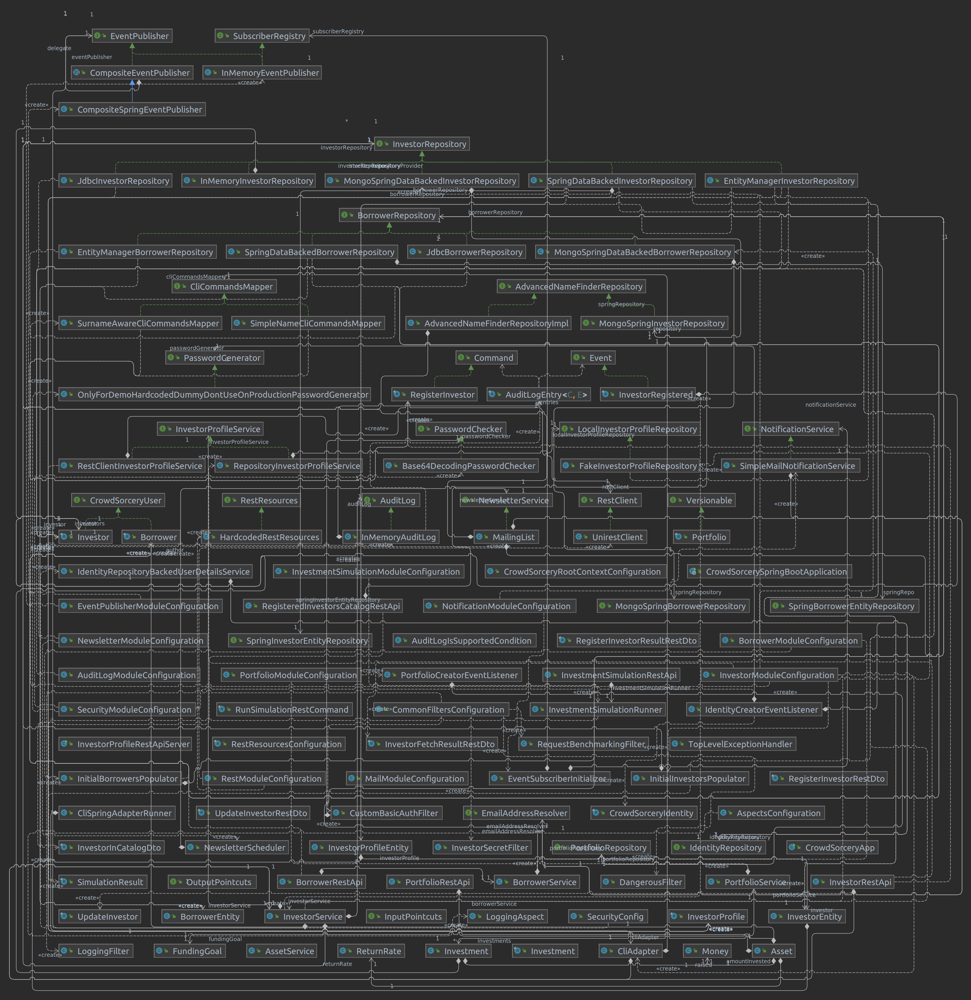

# Modular monolith

Currently, we have packages describing some of CrowdSorcery modules. However,
all of these packages are contained in a single Maven module. Therefore,
they can freely access internals of each other. This can easily get out of
control.

Your task is to extract CrowdSorcery module-packages into separate Maven
modules and make sure, that these modules can interact only via their public
APIs.

You should start with understanding the dependencies between modules and fix
potential design errors (e.g. cyclic dependencies). That's how the current
dependency diagram looks like ;)
